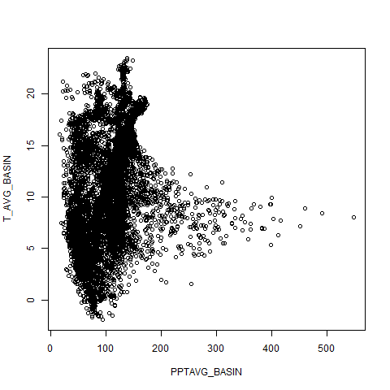
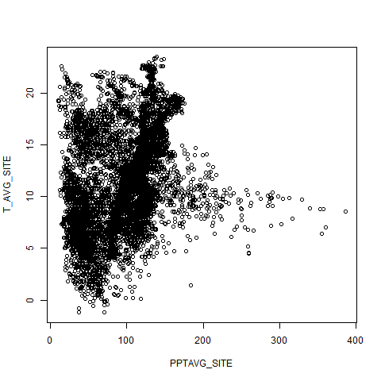

```{r setup, include=FALSE}
knitr::opts_chunk$set(echo = TRUE)
```

## Workflow

```{r workflow}
# source function files
source("scripts/getMyDataframe.R")
source("scripts/printMyPlots.R")

# get dataframe
mydf <- getMyDataframe("data/conterm_climate.csv")

x <- c("PPTAVG_BASIN", "PPTAVG_SITE")
y <- c("T_AVG_BASIN", "T_AVG_SITE")
files <- c("ppt.png", "t.png")
printMyPlots(x=x, y=y, mydf, filename = files)
```

## Including Plots

Precipitation


Temperature

